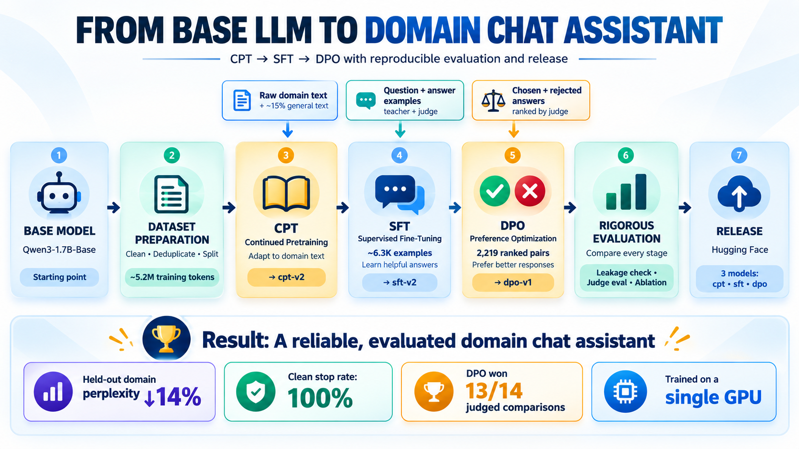

# llm-from-base-to-assistant

**An end-to-end post-training pipeline that turns an open base language model into a domain chat assistant: continued pretraining, supervised fine-tuning, preference optimization, and rigorous evaluation, on a single GPU.**

<p align="center">
  
</p>

**Try it live:** [Hugging Face Space demo](https://huggingface.co/spaces/vinmlops/llm-from-base-to-assistant)

| | |
|---|---|
| **Base model** | `Qwen/Qwen3-1.7B-Base` (pipeline prototyped on `Qwen/Qwen3-0.6B-Base`) |
| **Domain** | Machine learning, neural networks and large language models |
| **Stack** | PyTorch · Transformers · TRL · PEFT · vLLM · Datasets |
| **Hardware** | One 48 GB GPU |
| **Released models** | [`cpt-v2`](https://huggingface.co/vinmlops/cpt-v2) · [`sft-v2`](https://huggingface.co/vinmlops/sft-v2) · [`dpo-v1`](https://huggingface.co/vinmlops/dpo-v1) |
| **Live demo** | [huggingface.co/spaces/vinmlops/llm-from-base-to-assistant](https://huggingface.co/spaces/vinmlops/llm-from-base-to-assistant) |

---

## Highlights

- **Domain adaptation that measurably works:** continued pretraining on ~5.2M curated tokens lowered held-out domain perplexity by **~14%** with ~3% general drift. An ablation confirms the gain comes from this stage.
- **Synthetic instruction data with quality control:** teacher–judge generation, source-grouped leak-free splits, stratified validation.
- **Root-caused a silent end-of-turn failure:** stop-token probability **0.006 → 0.91**, sampled stop rate **20% → 100%**, verified after merge and reload.
- **Preference optimization with a hardened judge:** on-policy pairs, both-order consistency judging, five-verdict rubric, length-bias controls. dpo-v1 beats sft-v2 **13–1** in head-to-head evaluation.
- **Evaluation built to be trusted:** locked test set, leakage audit, confidence intervals, ablations, failure analysis, auto-generated reproducibility report.

---

## Results

### Model progression (unified evaluation, same held-out sets for every model)

| Model | Domain perplexity ↓ | General perplexity ↓ | Stops cleanly |
|---|---|---|---|
| Qwen3-1.7B-Base | 7.04 | 10.58 | — (text completer) |
| **cpt-v2** | **6.08** (−13.6%) | 10.91 (+3.1%) | — (text completer) |
| **sft-v2** | 6.13 | 11.06 | **100%** |
| **dpo-v1** | 6.13 | 11.08 | **100%** |
| *Ablation: SFT without CPT* | *7.10* | *10.74* | *100%* |

- **CPT supplies the domain knowledge; SFT and DPO preserve it.** SFT started directly from the base model shows no domain gain (7.10 vs 6.13).
- **DPO leaves perplexity unchanged, as expected:** it changes which answer the model prefers, not what it knows.

### Preference optimization (dpo-v1 vs sft-v2)

| Metric | sft-v2 | dpo-v1 |
|---|---|---|
| Held-out preference accuracy (333 pairs) | 57.4% | **62.5%** |
| Head-to-head LLM judge (both orders must agree) | 1 win | **13 wins** · 24 ties |
| Sampled stop rate (temperature 0.7) | 100% | 99% |
| Mean answer length | 37 tokens | 46 tokens |

No regressions on identity, safety or general-knowledge prompts.

### Data integrity

| Check | Result |
|---|---|
| SFT records traced to locked test documents | **0** / 6,707 |
| DPO prompts traced to locked test documents | **2** / 2,763 (0.1%) |

---

## Pipeline

| Stage | What it does | Key details |
|---|---|---|
| **1. CPT** | Teaches the domain | ~5.2M cleaned tokens (85% domain, 15% general replay); deduplicated, leak-free splits; full fine-tuning |
| **2. SFT** | Teaches the model to answer and stop | ~6.3K Q&A examples written by a teacher model and filtered by a separate judge; chat format; assistant-only loss |
| **3. DPO** | Teaches it to prefer better answers | 2,219 preference pairs from the model's own answers, judged in both orders; LoRA, merged into a standalone model |
| **4. Evaluation** | Checks every stage | Leakage audit, perplexity, behavior suite, stop verification, pairwise judging with confidence intervals, ablation |

---

## Repository layout

```
llm-from-base-to-assistant/
├── configs/        # one config per stage (data, training, evaluation)
├── data/           # collection, cleaning, splitting, SFT/DPO data builders
│   └── eval_heldout/   # locked test sets, never used for training or generation
├── training/       # cpt.py · sft.py · dpo.py · sft_from_base.py (ablation)
├── evaluation/     # perplexity, behavior suite, pairwise judging, leakage audit,
│                   # failure analysis, reproducibility report
├── scripts/        # environment and model inspection utilities
├── tests/          # masking, packing, judge-logic and statistics tests
└── docs/           # results and reproducibility report
    └── images/     # architecture diagram
```

---

## Quick start

```bash
pip install -r requirements.txt

# Stage 1 — continued pretraining
python data/collect.py          --config configs/day2.yaml
python data/clean.py            --config configs/day2.yaml
python data/split.py            --config configs/day2.yaml
python data/tokenize_pack.py    --config configs/day2.yaml
python training/cpt.py          --config configs/day2.yaml
python evaluation/perplexity.py --config configs/day2.yaml

# Stage 2 — supervised fine-tuning
python data/generate_sft.py     --config configs/day3.yaml
python data/judge_sft.py        --config configs/day3.yaml
python data/prepare_sft.py      --config configs/day3.yaml
python training/sft.py          --config configs/day3.yaml

# Stage 3 — preference optimization
python data/sample_candidates.py --config configs/day4.yaml
python data/judge_pairs.py       --config configs/day4.yaml
python data/prepare_dpo.py       --config configs/day4.yaml
python training/dpo.py           --config configs/day4.yaml

# Evaluation
python evaluation/leakage_check.py        --config configs/day5.yaml
python evaluation/eval_suite.py           --config configs/day5.yaml
python evaluation/dpo_eval.py             --config configs/day4.yaml
python training/sft_from_base.py          --config configs/day5.yaml   # ablation
python evaluation/failure_analysis.py     --config configs/day5.yaml
python evaluation/build_reproduce_doc.py  --config configs/day5.yaml
```

Generation and judging stages load the teacher and judge models sequentially, so peak memory fits a single 48 GB GPU.

---

## Using the model

```python
import torch
from transformers import AutoModelForCausalLM, AutoTokenizer

tok = AutoTokenizer.from_pretrained("vinmlops/dpo-v1")
model = AutoModelForCausalLM.from_pretrained("vinmlops/dpo-v1", dtype=torch.bfloat16).to("cuda")

messages = [
    {"role": "system", "content": "You are a helpful assistant with expertise in machine learning "
                                  "and large language models. Answer the user's question accurately "
                                  "and directly. Explain concepts clearly and acknowledge uncertainty "
                                  "when you are unsure."},
    {"role": "user", "content": "What is attention in a transformer?"},
]
inputs = tok(tok.apply_chat_template(messages, tokenize=False, add_generation_prompt=True),
             return_tensors="pt", add_special_tokens=False).to(model.device)
out = model.generate(**inputs, max_new_tokens=400, do_sample=False,
                     eos_token_id=tok.convert_tokens_to_ids("<|im_end|>"))
print(tok.decode(out[0][inputs["input_ids"].shape[1]:], skip_special_tokens=True))
```

For general (non-ML) questions, omit the system message; this matches how the model was trained.

---

## Known limitations

- **Concise responses.** Answers are accurate but brief (~40–60 tokens), a style inherited from the SFT data. This is the "correct but concise" limitation found in evaluation. Larger post-trained assistants give considerably more detailed explanations.
- **Uncertainty handling.** The model can state unverifiable facts confidently instead of acknowledging uncertainty.
- **Scale.** A 1.7B model with a modest corpus and preference set; not intended for production or critical use.
- **Evaluation scope.** LLM-judge-based quality metrics on a 38-prompt behavior suite; standard benchmarks and human evaluation are not yet included.

---

## Future improvements

### Response quality
- **Deeper, structured answers:** rebuild the SFT data with long-form explanations (definition, mechanism, example, pitfalls) for about 85% of examples, and concise answers for brevity requests.
- **Adaptive length:** DPO pairs where the shorter answer wins when the user asks for brevity, so the model learns *when* to go deep.
- **Instruction following:** examples with explicit format and length constraints ("in 3 bullets", "one sentence").
- **Multi-turn conversations:** follow-up questions that build on earlier answers.

### Reliability
- **Calibrated uncertainty:** explicit "not publicly known" examples in SFT and targeted DPO pairs (chosen = admits uncertainty, rejected = fabricated detail).
- **Source-grounded verification:** judge generated answers against their source text, with human spot checks.
- **Safety coverage:** a larger set of harmful requests (should refuse) and harmless-but-sensitive ones (should not refuse).

### Data
- **Larger clean domain corpus:** 20–50M tokens, with paper text extracted from LaTeX source instead of PDFs.
- **Broader sources:** more documentation, openly licensed textbooks and Q&A content.
- **More varied prompts:** real questions (why, compare, step by step, debug) instead of passage summaries.

### Training
- **Longer sequences:** raise SFT and DPO length limits (≈4K tokens) so long answers are never truncated.
- **Checkpoint selection:** save frequent checkpoints and keep the latest one that passes stop verification.
- **Controlled experiments:** one-variable sweeps of learning rate, β and the SFT anchor; evaluate alternative preference methods (SimPO, KTO, ORPO).
- **Longer context:** long-sequence training for document-level inputs.

### Evaluation
- **Standard benchmarks** across all checkpoints.
- **Independent judge** from a different model family, plus **blind human A/B ratings**.
- **Larger held-out question set** (100–200 prompts) for tighter confidence intervals.
- **Release gate:** quality, safety and stopping thresholds that must pass before a model is published.

### Deployment
- **Serving:** vLLM inference server with a containerized deployment.
- **Interactive demo:** ✅ live on [Hugging Face Spaces](https://huggingface.co/spaces/vinmlops/llm-from-base-to-assistant).

---

## License and data use

**Code:** MIT (see `LICENSE`). **Models:** CC-BY-NC-4.0, for non-commercial, educational and research use. The base model `Qwen/Qwen3-1.7B-Base` is Apache-2.0.

Training text was collected from publicly available sources, and each document is tagged with its source and license. The collected corpus and generated datasets are **not redistributed**. Individual research papers carry their own licenses, many of which are not open, so anyone reusing this pipeline is responsible for verifying the terms of each source, especially for commercial use. Rights holders with concerns may open an issue.
